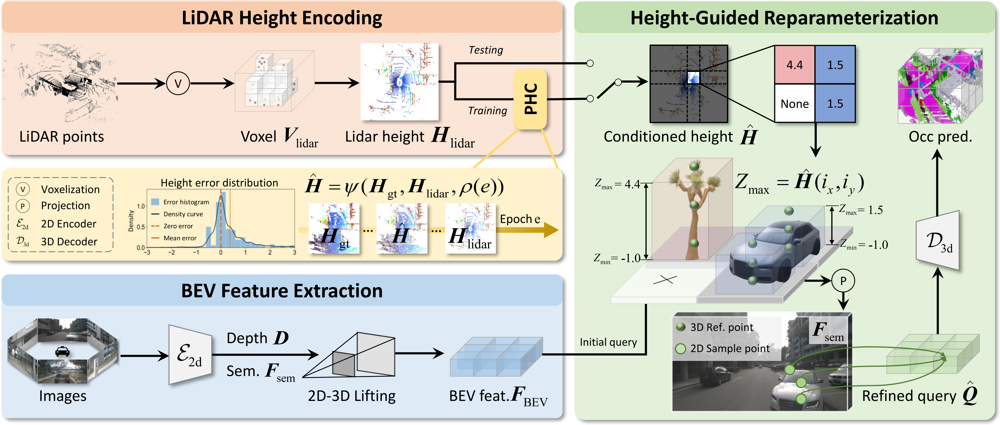

<div align="center">

# Height-Guided Projection Reparameterization for <br> Camera-LiDAR Occupancy

[](https://arxiv.org/pdf/2605.05072)


</div>

---

## 📖 Overview

<div align="center">
  
</div>


## <a id="get-started"></a>🚀 Get Started

```bash
# Create and activate the conda environment
conda create -n HiPR python=3.8 -y
conda activate HiPR

# Install PyTorch dependencies (for CUDA 11.8)
pip install torch==2.0.1+cu118 torchvision==0.15.2+cu118 -f https://download.pytorch.org/whl/torch_stable.html

# Install MMCV dependencies
git clone https://github.com/open-mmlab/mmcv
cd mmcv
git checkout 1.x # Use the stable 1.x branch
MMCV_WITH_OPS=1 pip install -e . -v
cd ..

# Install MMDetection and MMSegmentation
pip install mmdet==2.28.2 mmsegmentation==0.30.0

# Install the OccStudio
pip install -v -e .

# Install other dependencies
pip install torchmetrics timm dcnv4 ninja spconv transformers IPython einops numba
pip install numpy==1.23.4 # Pin numpy version for compatibility

# (Optional for SparseOcc)
cd mmdet3d/models/sparseocc/csrc
pip install -v -e .
```

---

## <a id="usage"></a>🎮 Training and Testing

```bash
# Training
bash tools/dist_train.sh [CONFIG_FILE] [WORK_DIR] [NUM_GPUS]

# Testing
bash tools/dist_test.sh [CONFIG_FILE] [CHECKPOINT_PATH] [NUM_GPUS]
bash tools/dist_test_ray.sh [CONFIG_FILE] [CHECKPOINT_PATH] [NUM_GPUS]
```

---

## <a id="checkpoints"></a>📦 Checkpoints

Trained model weights are available at:

👉 [Google Drive Checkpoints](https://drive.google.com/drive/folders/19a9Sme8mSQfdCuDpyBBM-uGNePRGelmQ?usp=sharing)

---

## <a id="acknowledgements"></a>🙏 Acknowledgements

This project is built upon the excellent open-source codebases from the community. 
We sincerely thank the authors and contributors for their great work.

- [OccStudio](https://github.com/cdb342/OccStudio)
- [FB-Occ](https://github.com/NVlabs/FB-BEV)
- [ProtoOcc](https://github.com/SPA-junghokim/ProtoOcc)

---

## <a id="citation"></a>📄 Citation

If you find this project useful, please consider citing our work:

```bibtex
@article{wu2026height,
  title={Height-Guided Projection Reparameterization for Camera-LiDAR Occupancy},
  author={Wu, Yuan and Yan, Zhiqiang and Lian, Jiawei and Wang, Zhengxue and Yang, Jian},
  journal={arXiv preprint arXiv:2605.05072},
  year={2026}
}
```
